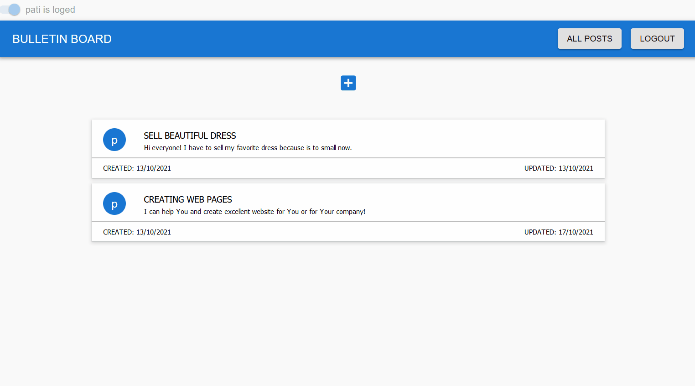

# BULLETIN BOARD

BULLETIN BOARD is full stack application to adding announcement. This project was bootstrapped with [Create React App](https://github.com/facebook/create-react-app). Project is divided into front-end and back-end parts. Front-end was build based on React with Redux and Material-UI. Back-end was build with Express & MongoDB.

## How it works

## Link
https://olx.webster2020.com/

## How to start:
1. git clone git@github.com:Webster2020/BULLETIN_BOARD.git
2. yarn install
3. yarn start - run the project and than You can see it on Your device

*...or use link if You only want to check how it works

## Used technologies:

### FRONT-END:
 1. React with Hooks - as main library
 2. Redux - store
 3. Material-UI - for building most of components and styling
 4. SCSS - for additional styling
 6. React Router - for routing
 7. React Thunk - for fetching data
 8. Eslint - to control bugs
 9. Husky - to control bugs before every commit
 10. Lint Staged - to check only changed files
### BACK-END:
 1. Express - server
 2. MognoDB & Mongoose - database

## Implemented solutions:
Application's front-end is divided into few views, main views: Homepage, Post, PostAdd and PostEdit.
 1. Homepage:
 - bar with buttons: if user logout: login and register, if user login: logout and myposts 
 - list of posts
 - button to adding post
 2. Post:
 - information about post
 - if user login and user is post's author: buttons to edit and delete post
 3. PostAdd: 
 - form with inputs 
 4. PostEdit:
 - form with inputs 
 - preview of the edited post
Application's back-end is built with server.js, routes with routes.js files and models with model.js files
 1. Server
 - endpoints and connect with mongo database
 2. Routes
 - endpoints
 3. Models
 - schemes database collections

## Project architecture
Project is not divided into components in accordance with the React convention.
 1. components with JS, JSX and SCSS
 2. root file: index.html
 3. store and reducers in redux folder
 4. others functions in utils
 5. configuration files: gitignore, package.json, etc.
 6. data with mongo
 7. server with express

## How did I create this project?
Project was prepared based on my own idea and using my current knowledge and skills.

## Plan for future development
- Refactor code
- Login / Register forms validation

## Authors
* **Michal Szwajgier** - *Webster2020* - 

## License
Free licence
